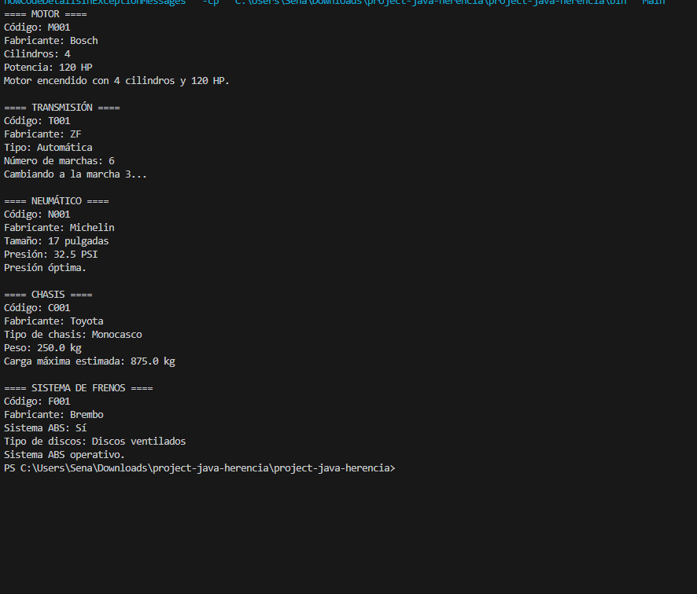

 🚗 Sistema de Componentes Vehiculares
 project-java-herencia

## 📝 Descripción
Este proyecto implementa un sistema de componentes vehiculares en Java, utilizando herencia y polimorfismo para modelar diferentes partes de un vehículo.

## 🔧 Componentes
- 🏭 `ComponenteVehicular`: Clase base para todos los componentes
- 🛠️ `Motor`: Gestiona el funcionamiento del motor
- ⚙️ `Transmision`: Controla el sistema de transmisión
- 🛞 `Neumatico`: Maneja información de los neumáticos
- 🧱 `Chasis`: Administra datos del chasis
- 🛑 `SistemaFrenos`: Controla el sistema de frenos

## 💡 Funcionalidades
- Mostrar información de cada componente
- Encender motor
- Cambiar marchas
- Verificar presión de neumáticos
- Calcular carga máxima del chasis
- Verificar sistema ABS

### 📸 Captura de pantalla del sistema

